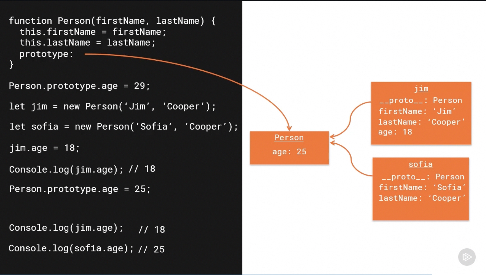
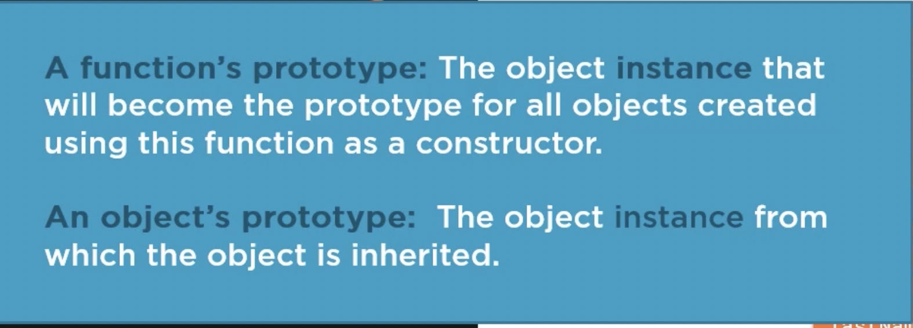

# JavaScript Prototypes and Inheritance
- Every function in JavaScript has prototype property

```js
let myFunction = function () {}
console.log(myFunction.prototype) // {}

let person = {name: 'AB'};
console.log(person.prototype) // undefined
console.log(person.__proto__) // Object  {}
```

#### Function's Prototype
A function's prototype is the object instance that will become the prototype
for all objects created using this function as a constructor.

#### Object's Prototype
An object's prototype is the object instance from which the object is by inherited.

- Example
```js

function Person(firstName, lastName) {
    this.firstName = firstName;
    this.lastName = lastName;
}

Person.prototype.age = 29;
display(Person.prototype) // Person {age: 29}

let jim = new Person('Jim', 'Cooper')
let sofia = new Person('Sofia', 'Cooper')
sofia.__proto__.age = 19;

display(jim.__proto__) // Person {age: 29}
display(sofia.__proto__) // Person {age: 29}
display(sofia.__proto__ === Person.prototype) // true
```

```js

    function Person(firstName, lastName) {
        this.firstName = firstName;
        this.lastName = lastName;
    }

    Person.prototype.age = 29;
    let jim = new Person('Jim', 'Cooper')
    let sofia = new Person('Sofia', 'Cooper')

    display(jim.age) // 29
    display(sofia.age) // 29

    display(jim.hasOwnProperty('age')) // false
    jim.age = 18;
    display(jim.hasOwnProperty('age')) // true
    display(jim.age) // 18
    display(jim.__proto__.age) // Still 29

```


